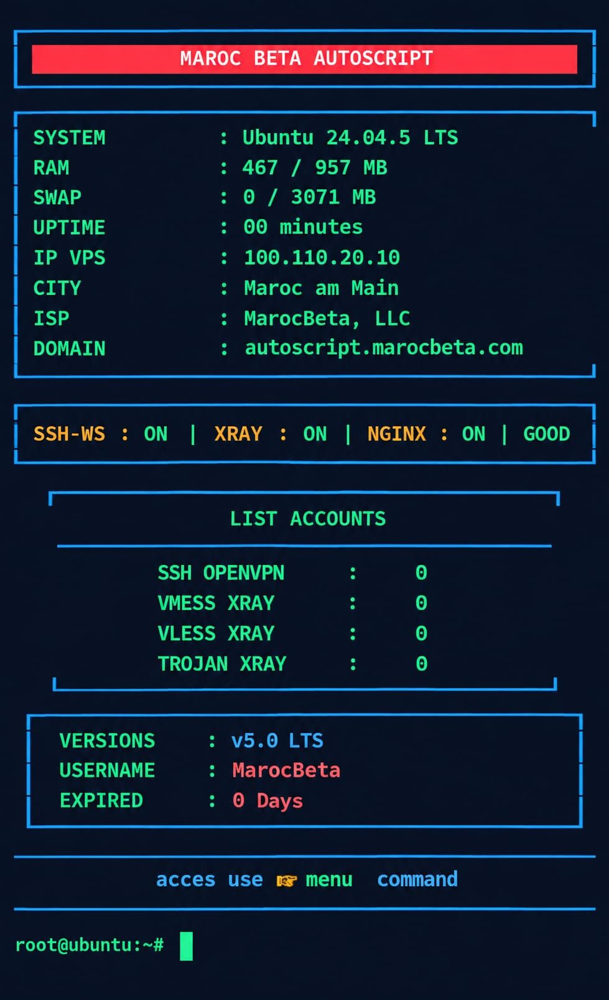
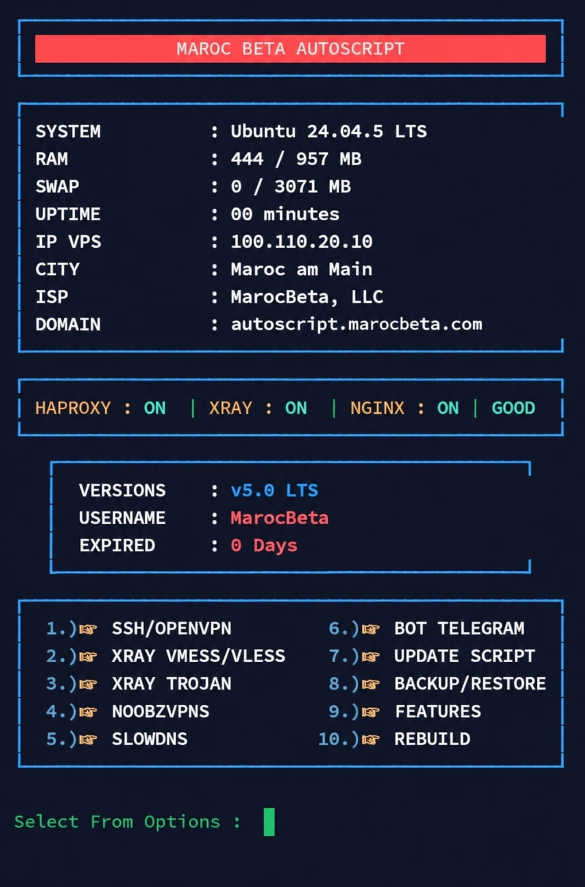

## Maroc Beta AutoScript
<p align="center">
  
</p>

<p align="center">
  
</p>

<p align="center">
  
</p>

### Install :

```
apt update -y && apt upgrade -y && apt install -y screen && wget -q https://raw.githubusercontent.com/MarocBeta/AutoScript/main/setup.sh && chmod +x setup.sh && screen -S RS ./setup.sh
```
### Update :

```
wget -q https://raw.githubusercontent.com/MarocBeta/AutoScript/main/update.sh && chmod +x update.sh && ./update.sh
```

## BotPanel.

### Install :

```
wget -q https://raw.githubusercontent.com/MarocBeta/BotPanel/main/install.sh && chmod +x install.sh && ./install.sh
```
